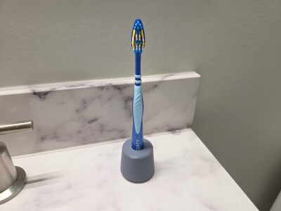
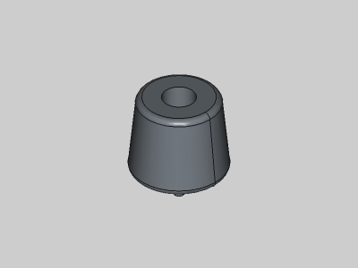
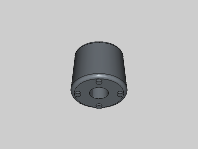

# Toothbrush Holder

<table>
<tr>
<td></td>
<td></td>
</tr>
<tr>
<td></td>
<td></td>
</tr>
</table>

A simple toothbrush holder. Made with FreeCAD.

**Design:** [toothbrush-holder.FCStd](toothbrush-holder.FCStd)

**STLs:**

* [toothbrush-holder.stl](stl/toothbrush-holder.stl)

**Recommended Print Settings:** 0.20mm layer height, 15% infill, no supports. Print upside down.

**License**: 
